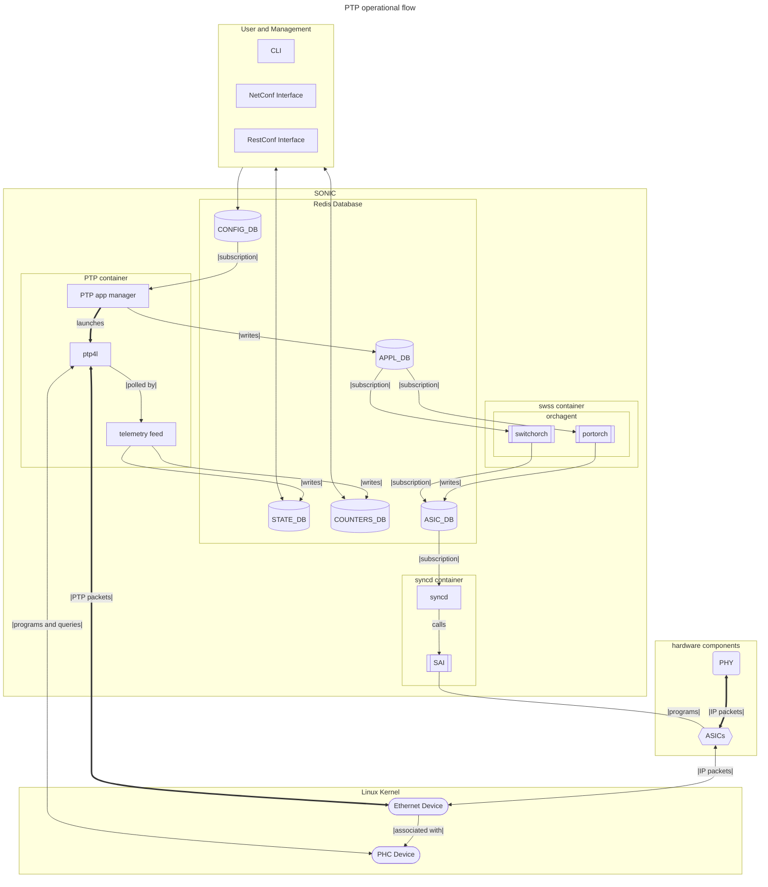

# PTP Feature

### High Level Design document

### Table of Contents

- [PTP Feature](#ptp-feature)
  - [High Level Design document](#high-level-design-document)
  - [Table of Contents](#table-of-contents)
  - [Revision](#revision)
  - [About this manual](#about-this-manual)
  - [Scope](#scope)
  - [Abbreviations](#abbreviations)
- [1 Introduction](#1-introduction)
- [2 Feature Design](#2-feature-design)
  - [2.1 Operational Flow](#21-operational-flow)
  - [2.2 PTP Container](#22-ptp-container)
  - [2.3 Time Distribution Network Variants](#23-time-distribution-network-variants)
    - [2.3.1 Ordinary Clock](#231-ordinary-clock)
    - [2.3.2 Transparent Clock](#232-transparent-clock)
    - [2.3.3 Boundary Clock](#233-boundary-clock)
    - [2.3.4 IPv4/IPv6 Unicast transports](#234-ipv4ipv6-unicast-transports)
    - [2.3.5 IPv4/IPv6 Multicast transports](#235-ipv4ipv6-multicast-transports)
    - [2.3.6 L2](#236-l2)
  - [2.4 Hardware Features Support](#24-hardware-features-support)
    - [2.4.1 Hardware Timestamping Configuration](#241-hardware-timestamping-configuration)
    - [2.4.2 Static Delay Assymetry Configuration](#242-static-delay-assymetry-configuration)
    - [2.4.3 SyncE](#243-synce)
    - [2.4.4 G.8275.1 Support](#244-g82751-support)
    - [2.4.5 Phase Correction](#245-phase-correction)
  - [Linked Hardware Clocks in Multi-ASIC Devices](#linked-hardware-clocks-in-multi-asic-devices)
- [3 Requirements Roadmap](#3-requirements-roadmap)
  - [3.1 Phase 1](#31-phase-1)
  - [3.2 Phase 2](#32-phase-2)
- [4 Configuration](#4-configuration)
- [5 Module Design](#5-module-design)
  - [5.1 PTP Container](#51-ptp-container)
  - [5.2 PTP orchagent](#52-ptp-orchagent)
  - [5.3 Syncd Updates](#53-syncd-updates)
  - [5.4 SAI Updates](#54-sai-updates)
  - [5.5 SAI implementations and ASIC Device Driver Updates](#55-sai-implementations-and-asic-device-driver-updates)
  - [5.6 Linux Ethernet Device Update](#56-linux-ethernet-device-update)
  - [5.7 PHC Device](#57-phc-device)
- [6 Testing](#6-testing)
- [6.1 Phase 1 Testing](#61-phase-1-testing)

### Revision


| Rev | Date | Author     | Change Description |
| --- | ---- | ---------- | ------------------ |
| 0.1 |      | Maike Geng | Initial edition    |


### About this manual

This document provides an overview of the PTPv2 feature in SONiC.

### Scope

This document is the high level design document for running a SONiC switch as a PTPv2 boundary/ordinary/transparent clock.  It provides an overview of feature configuration and operation and its flow through SONiC and its sub-systems. This document has a [companion document](./ptp-data-models.md) detailing the data models used in configuration, application states, and operations states.  The contents of those data models will not be part of this document.

### Abbreviations


| Term  | Meanings                                                             |
| ----- | -------------------------------------------------------------------- |
| ASIC  | Application-Specific Integrated Circuit                              |
| BC    | Boundary Clock                                                       |
| BMCA  | Best Master Clock Algorithm                                          |
| DB    | Database                                                             |
| CLI   | Command-line Interface                                               |
| NTP   | Network Time Protocol                                                |
| OC    | Ordinary Clock                                                       |
| pmc   | PTP Management Client; a linux-ptp executable                        |
| PHC   | Physical Hardware Clock; Linux timing synchronization infrastructure |
| PTP   | Precision Time Protocol                                              |
| PTPv2 | PTP Version 2; IEEE-1588 2008 specification with 2019 enhancements   |
| ptp4l | PTP daemon for Linux; a linux-ptp executable                         |
| SAI   | Switch Abstraction Interface                                         |
| SONiC | Software for Open Networking in the Cloud                            |
| TC    | Transparent Clock                                                    |
| UDS   | Unix Domain Socket                                                   |
| YANG  | Yet Another Next Generation                                          |


# 1 Introduction

Certain distributed applications require good time synchronize across nodes.  For applications that require time synchronization on the order of ten milliseconds, NTP can run on nodes and may already be sufficient.  For applications that require time synchronization on the order of milliseconds or better, PTPv2 is the industry-standard network protocol for achieving such time synchronization.  In PTPv2 deployments, running PTP boundary clocks or PTP transparent clocks on network switches between nodes and authoritative time sources will improve the accuracy and the scalability of the solution.  By enabling the PTP feature and applying PTP configurations, SONiC switches will be able to operate as PTPv2 clocks.

# 2 Feature Design

PTP is an [optional feature application](../optional-feature-control/Optional-Feature-Control.md) that can be enabled or disabled.  When the PTP feature is enabled, SONiC will launch its PTP container on a per-ASIC namespace basis.  The PTP container operates as a PTPv2 boundary, ordinary, or transparent clock, depending on the configuration. The PTP protocol stack is handled by open-source ptp4l.  The PTP feature implements PTPv2.1 and will not support PTPv1 protocol.  It works on ports attached to ASICs and is not applicable to out-of-band management ports.

## 2.1 Operational Flow




## 2.2 PTP Container

The PTP protocol stack is processed in the PTP container.  When SONiC launches the PTP service, one instance of the PTP container runs in each ASIC namespace.

When a PTP container starts, it launches an instance of the PTP app manager which will read the SONiC configuration from CONFIG_DB.  PTP configuration consists of a base ptp4l configuration that all PTP containers share and configuration for Ethernet ports.   The PTP app manager will combine configuration for Ethernet ports that are applicable to the ASIC namespace with the base ptp4l configuration and write a /etc/ptp4l.cfg inside the container.  When the /etc/ptp4l.cfg is written, the PTP app manager will start the ptp4l process.  After the ptp4l process starts, the PTP app manager will start a telemetry feed process.  The telemetry feed process will regularly query the ptp4l process for status and statistics through ptp4l's UDS/pmc interface and push all status and statistics into STATE_DB and COUNTERS_DB.

When PTP configuration changes, the PTP app manager detects the SONiC configuration changes, updates the /etc/ptp4l.cfg file, and relaunches the ptp4l and telemetry feed processes.  On-the-fly configuration is not supported.

## 2.3 Time Distribution Network Variants

The ptp4l process may operate as boundary clock, ordinary clock, or transparent clock with the ptp4l configuration file.  The ptp4l process may exchange ptp packets with L2 transport, unicast IPv4 or IPv6 transport, or multicast IPv4 or IPv6 transport.  There is no development effort in PTP feature associated with supporting these variations of operation.  However, testing resources properly configured in the requisite time distribution network is non-trivial.  Validation of these operation variants will be introduced on an as-needed basis associated with well-defined target use cases.

### 2.3.1 Ordinary Clock

Ordinary Clock operation mode is when the SONiC network device recovers time from upstream master.

### 2.3.2 Transparent Clock

Transparent Clock operation mode is when the SONiC network device timestamps PTP event messages.  Transparent clocks can be configured to operate in either E2E mode or P2P mode.

### 2.3.3 Boundary Clock

Boundary Clock operation mode is when the SONiC network device recovers time from upstream master and serves as potential master to other network devices.

### 2.3.4 IPv4/IPv6 Unicast transports

PTP packets may be transported with unicast IPv4 or IPv6 packets.

### 2.3.5 IPv4/IPv6 Multicast transports

PTP packets may transmit certain PTP messages using multicast IPv4 or IPv6 packets.  Using this transport mode reduces packet load on the upstream master clocks, but requires switch devices in the network to support multicast routing and track multicast memberships.

### 2.3.6 L2 transport

PTP packets may transmit PTP packets with L2 addresses.

## 2.4 Hardware Features Support

Different PTPv2 deployments can have orders of magnitude differences in the accuracy of time synchronization, ranging from sub-millisecond accuracy of software timestamping to sub-nanosecond accuracy of White Rabbit PTP deployments.  The deployments with higher accuracy have Ethernet hardware with hardware features that can minimize the errors or measure errors to enable algorithms to remove them.  Software features that enable these hardware features are optional and may not be applicable to all PTPv2 deployments.  Thus the PTP feature can become deployable before support for any or all of these hardware features are supported in SONiC.

### 2.4.1 Hardware Timestamping Configuration

PTPv2 can use Ethernet ports with can be configured for hardware timestamping, 
Hardware timestamping can be configured to operate in one-step hardware timestamping mode or two-step hardware timestamping mode.

### 2.4.2 Static Delay Assymetry Configuration

SONiC switch vendor may statically measure delay assymetry on Ethernet ports in their system and provide these.

There are currently no target use cases that require this feature, and no further design details have been defined.

### 2.4.3 SyncE

Operating in conjunction with SyncE is part of gPTP/802.1AS specification.

There are currently no target use cases that require this feature, and no further design details have been defined.

### 2.4.4 G.8275.1 Support

G8275.1 requires support for SyncE, uses alternate BCMA logic, and can recover from two different grandmaster.

There are currently no target use cases that require this feature, and no further design details have been defined.

## 2.5 Linked Hardware Clocks in Multi-ASIC Devices

With per-ASIC namespace instantiation of the PTP container, ptp4l operates with the assumption that each ASIC has a PHC that can be adjusted independently.  Some multi-device/multi-ASIC clock systems may not adhere to this assumption and have PHCs for multi-ASICs that are tied together.  Phase 2 may require support for this kind of hardware, however no design details have been defined and is TBD.

# 3 Requirements Roadmap

Development of the PTP feature will proceed in phases.  Software support for hardware features will be developed on an as-needed basis with well-defined target use cases.

## 3.1 Phase 1

Phase 1 will support hardware timestamping.
Testing will validate the PTP feature on single-ASIC pizza box SONiC network devices configured to run a PTPv2 BC, over unicast IPv4 transport, with default IEEE-1588 profle, using one-step hardware timestamping.
Phase 1 is part of 26.11 release.

## 3.2 Phase 2

Testing will validate the PTP feature on multi-device multi-ASIC SONiC network devices, with everything else remaining the same, running as PTPv2 BC, over unicast IPv4 transport, with default IEEE-1588 profle, using one-step hardware timestamping.

# 4 Configuration

All ptp4l configuration will be handled by updating /etc/ptp4l.conf file

The following new commands will be introduced in SONiC

```bash
Enable/Disable PTP feature on a particular device:
config feature state ptp enabled/disabled

Enable/disable PTP on a particular interace:
config ptp port add/remove <interface name>

The following commands will have an entry for ptp
show feature config 
show feature status

Show which ports have PTP enabled/disabled:
show ptp port status

Shows ptp status:
show ptp status

Shows ptp interface counters:
show ptp counters <interface name>

Clears ptp counters on all ports:
clear ptp counters
```

# 5 Module Design

## 5.1 PTP Container

The PTP Container is a new container.  It runs three processes, PTP app manager, ptp4l, and telemetry feed.

The PTP app manager is a new process that interfaces with SONiC databases, prepares ptp4l configuration and launches ptp4l.

The ptp4l processes is [open-source software] (git://git.code.sf.net/p/linuxptp/code) from the Linux PTP project.  It implements the PTP for Linux using Linux SO_TIMESTAMPING socket option and Linux PTP Hardware Clock subsystem.
*specify version?*

The telemetry feed is new process that will read information out of ptp4l through its UDS interface.  It will update SONiC databases, STATE_DB and COUNTERS_DB, for status and statistics.

## 5.2 orchagent

Switch orch will recognize a switch_ptp_mode attribute and translate it into SAI_SWITCH_ATTR_PORT_PTP_MODE for ASIC_DB.  Port orch will recognize port_ptp_mode attribute and translate it into SAI_PORT_ATTR_PTP_MODE.

## 5.3 Syncd Updates

The syncd is an existing process that subscribes to ASIC_DB and applies changes to ASICs through SAI calls.  The required SAI definitions already exist and no changes are necessary.

## 5.4 SAI Interface

The SAI is an existing library component with vendor-specific implementation. SAI already defines attributes for PTP modes in switch and port objects and no changes are necessary.

## 5.5 SAI implementations and ASIC Device Driver Updates

The SAI implementation and ASIC device driver is an existing vendor-specific component.  To support the PTP feature, the ASIC device driver creates and maintains Linux Ethernet devices that have associated Linux PHC devices.  The ASIC device driver will be invoked from vendor-specific SAI implementation with support for SAI_SWITCH_ATTR_PORT_PTP_MODE on switch objects and SAI_PORT_ATTR_PTP_MODE on port objects.

## 5.6 Linux Ethernet Device Update

The Ethernet device is an existing standard Linux device infrastructure object representing Ethernet ports. When applicable, the Ethernet device will advertise hardware timestamping capability and have an associated Linux PHC device.  For hardware timestamping support, the Linux Ethernet devices will advertise SOF_TIMESTAMPING_TX_HARDWARE, SOF_TIMESTAMPING_RX_HARDWARE, and SOF_TIMESTAMPING_RAW_HARDWARE capabilities.  ptp4l interacts directly with the Linux Ethernet device.

## 5.7 PHC Device

The PHC device is a new standard Linux infrastructure object representing PTP clocks. ptp4l interacts directly with the Linux PHC device.

# 6 Testing

Testing will be automated to validate the feature and deployment models found in each phase.  The testing HLD will be a separate document and is currently TBD.
As per [phase 1](#31-phase-1) and [phase 2](#32-phase-2), testing will be limited to the targeted use cases.