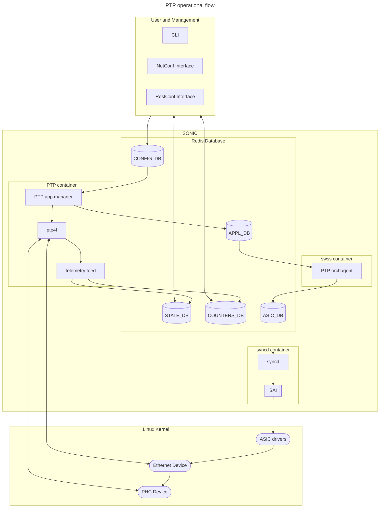

# PTP Feature

## High Level Design document

## Table of Contents

- [Revision](#revision)
- [About this manual](#about-this-manual)
- [Scope](#scope)
- [Abbreviations](#abbreviations)
- [1 Introduction](#1-introduction)
- [2 Requirements Roadmap](#2-requirements-roadmap)
  - [2.1 General Requirements](#21-general-requirements)
  - [2.2 Phase 1](#22-phase-1)
  - [2.3 Phase 2](#23-phase-2)
  - [2.4 Phase 3 and Future](#24-phase-3-and-future)
- [3 Feature](#3-feature)
  - [3.1 Operation Flow](#31-operation-flow)
  - [3.2 Multi-ASIC and Chassis extensions](#32-multi-asic-and-chassis-extensions)
- [4 Modules](#4-modules)
  - [4.1 PTP Container](#41-ptp-container)
  - [4.2 PTP orchagent](#42-ptp-orchagent)
  - [4.3 Syncd Updates](#43-syncd-updates)
  - [4.4 SAI Updates](#44-sai-updates)
  - [4.5 ASIC Device Driver Updates](#45-asic-device-driver-updates)
  - [4.6 Linux Ethernet Device Update](#46-linux-ethernet-device-update)
  - [4.7 PHC Device](#47-phc-device)

## Revision

| Rev | Date | Author     | Change Description |
| --- | ---- | ---------- | ------------------ |
| 0.1 |      | Maike Geng | Initial edition    |

## About this manual

This document provides an overview of the PTPv2 feature in SONiC.

## Scope

This document is the high level design document for running a SONiC switch as a PTPv2 boundary/ordinary/transparent clock.  It provides an overview of feature configuration and operation and its flow through SONiC and its sub-systems. This document has a [companion document](./ptp-data-models.md) detailing the data models used in configuration, application states, and operations states.  The contents of those data models will not be part of this document.

## Abbreviations

| Term  | Meaning s                                                            |
| ----- | -------------------------------------------------------------------- |
| ASIC  | Application-Specific Integrated Circuit                              |
| BC    | Boundary Clock                                                       |
| BMCA  | Best Master Clock Algorithm                                          |
| DB    | Database                                                             |
| CLI   | Command-line Interface                                               |
| OC    | Ordinary Clock                                                       |
| pmc   | PTP Management Client; a linux-ptp executable                        |
| PHC   | Physical Hardware Clock; Linux timing synchronization infrastructure |
| PTP   | Precision Time Protocol                                              |
| PTPv2 | PTP Version 2; IEEE-1588 2008 specification with 2019 enhancements   |
| ptp4l | PTP daemon for Linux; a linux-ptp executable                         |
| SAI   | Switch Abstraction Interface                                         |
| SONiC | Software for Open Networking in the Cloud                            |
| TC    | Transparent Clock                                                    |
| UDS   | Unix Domain Socket                                                   |
| YANG  | Yet Another Next Generation                                          |

# 1 Introduction

Timing synchronization across nodes in a data center supports many applications that require a corresponding level of precision and accuracy. PTPv2 is the industry-standard network protocol for achieving tight timing synchronization over an Ethernet network. Achieving such tight timing synchronization and scaling the timing synchronization to all nodes requires running PTP boundary clocks or PTP transparent clocks on the network switches.  The PTP feature enables the operator to run PTPv2 boundary clocks or transparent clocks or ordinary clocks on SONiC switches.

# 2 Requirements Roadmap

Development of the PTP feature can take place in phases targeting more specific use cases using a narrower subset of hardware devices.

# 2.1 General Requirements

The PTP feature will support PTPv2 and will not support the older PTP protocol.  It supports PTP over ports attached to ASICs.  It is not applicable to management Ethernet ports.

# 2.2 Phase 1

Delivery date for phase 1 is in the 26.11 version of SONiC. The target use case is timing synchronization to within 1us margin-of-error from GM to nodes through several SONiC network devices running as PTPv2 BCs. The applicable hardware are network devices that are single devices with single ASICs. Hardware timestamping support in the network devices is required and ASICs are only configured for one-step timestamping.

# 2.3 Phase 2

Delivery date for phase 2 is after the 26.11 version of SONiC.  Phase 2 is an enhancement on phase 1, adding multi-device systems and multi-ASIC network devices to the pool of applicable hardware.

# 2.4 Phase 3 and Future

Delivery date for phase 3 is unspecified. Phase 3 is the general use case. It targets the full range of accuracy in synchronization, and the applicable hardware is all permutations of SONiC network devices.

## 3 Feature

PTP is an [optional feature application](../optional-feature-control/Optional-Feature-Control.md) that can be enabled or disabled.  When the PTP feature is enabled, SONiC will launch its PTP container on a per-ASIC namespace basis.  The PTP container operates as a PTPv2 boundary, ordinary, or transparent clock, depending on the configuration. The implementation is compliant with the IEEE-1588-2008 standard, uses the default BMCA, and is implemented with open-source ptp4l.

## 3.1 Operation Flow

The core functionality of the PTP feature happens in the PTP container.  When the PTP feature is enabled and setup prerequisites are met, SONiC will launch the PTP service, one instance of the PTP container for every ASIC namespace.

When a PTP container starts, the PTP app manager starts, reads the configuration from CONFIG_DB for its instance, configures the ASIC for PTP operation, writes the configuration for the instance, starts the ptp4l executable, and starts the telemetry feed executable.

When the telemetry feed process is running, it subscribes to status and statistics from the ptp4l process with pmc or via ptp4l's UDS interface.  The telemetry feed process will push status and statistics to STATE_DB and COUNTERS_DB.

## 3.2 Phase 1 Limitations
In phase 1 of deliverables, when configuring the ASIC for PTP operation, the PTP app manager configures all external ports of the ASIC for one-step PTP hardware timestamping of unicast IPv4 PTP packets.

## 3.3 Multi-ASIC and Chassis extensions

The PTP feature on Multi-ASIC and Chassis network devices mostly operates under the same operation flow as single-device, single-ASIC network devices.  There will be more than one active instance of the PTP container and ptp4l may send and accept PTP packets to other ptp4l instances over system ports.  The PTP app manager configures the systems ports of the ASIC for one-step PTP hardware timestamping.

The SAI and ASIC drivers may require updates to support hardware timestamping and related configurations in order to work with the internal system ports.

## 4 Modules

# 4.1 PTP Container

The PTP Container is a new container.  It runs three processes, PTP app manager, ptp4l, and telemetry feed.

The PTP app manager is a new process that interfaces with SONiC databases, prepares ptp4l configuration and launches ptp4l.

The ptp4l processes is [open-source software] (git://git.code.sf.net/p/linuxptp/code) from the Linux PTP project.  It implements the PTP for Linux using Linux SO_TIMESTAMPING socket option and Linux PTP Hardware Clock subsystem.
*specify version?*

The telemetry feed is new process that will read information out of ptp4l through its UDS interface.  It will update SONiC databases, STATE_DB and COUNTERS_DB, for status and statistics.

# 4.2 PTP orchagent

The PTP orchagent is a new component that is added to the swss container.  The PTP orchagent will read PTP state from APPL_DB for PTP port configurations and update ASIC_DB for PTP port configurations.

# 4.3 Syncd Updates

The syncd is an existing process that subscribes to ASIC_DB and applies changes to ASICs through SAI calls.  To support the PTP feature, syncd will need to support the new PTP port configurations in ASIC_DB and make new SAI calls.

* Does syncd already support the SAI calls that already exist *

# 4.4 SAI Updates

The SAI is an existing library component with vendor-specific implementation. SAI already supports PTP modes for switch and ports and no changes are necessary.

* to be removed: To support the PTP feature, SAI will need to add interfaces to support PTP port configurations.

- SAI API update proposals go to OCP instead?  Do we add something there and link the file here? *

## 4.5 ASIC Device Driver Updates

The ASIC device driver is an existing vendor-specific component.  To support the PTP feature, the ASIC device driver will create and maintain Linux Ethernet devices that have associated Linux PHC devices.  The ASIC device driver will be invoked from vendor-specific SAI implementation with support for SAI_SWITCH_ATTR_PORT_PTP_MODE on switch objects and SAI_PORT_ATTR_PTP_MODE on port objects.

## 4.6 Linux Ethernet Device Update

The Ethernet device is an existing standard Linux device infrastructure object representing Ethernet ports. When applicable, the Ethernet device will advertise hardware timestamping capability and have an associated Linux PHC device.  For hardware timestamping support, the Linux Ethernet devices will advertise SOF_TIMESTAMPING_TX_HARDWARE, SOF_TIMESTAMPING_RX_HARDWARE, and SOF_TIMESTAMPING_RAW_HARDWARE capabilities.  ptp4l interacts directly with the Linux Ethernet device.

## 4.7 PHC Device

The PHC device is a new standard Linux infrastructure object representing PTP clocks. ptp4l interacts directly with the Linux PHC device.