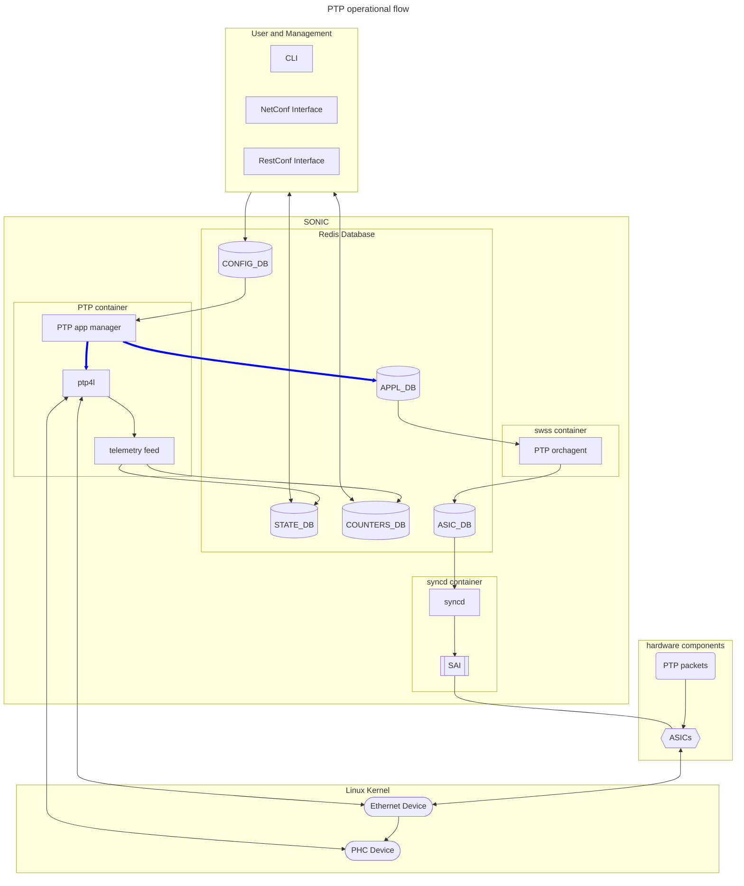

# PTP Feature

### High Level Design document

### Table of Contents

- [PTP Feature](#ptp-feature)
    - [High Level Design document](#high-level-design-document)
    - [Table of Contents](#table-of-contents)
    - [Revision](#revision)
    - [About this manual](#about-this-manual)
    - [Scope](#scope)
    - [Abbreviations](#abbreviations)
- [1 Introduction](#1-introduction)
- [2 Requirements Roadmap](#2-requirements-roadmap)
  - [2.1 General Requirements](#21-general-requirements)
  - [2.2 Phase 1](#22-phase-1)
  - [2.3 Phase 2](#23-phase-2)
  - [2.4 Phase 3 and Future](#24-phase-3-and-future)
- [3 Feature](#3-feature)
  - [3.1 Operation Flow](#31-operation-flow)
  - [3.2 Phase 1 Limitations](#32-phase-1-limitations)
  - [3.3 Multi-ASIC and Chassis extensions](#33-multi-asic-and-chassis-extensions)
- [4 Configuration](#4-configuration)
- [5 Modules](#5-modules)
  - [5.1 PTP Container](#51-ptp-container)
  - [5.2 PTP orchagent](#52-ptp-orchagent)
  - [5.3 Syncd Updates](#53-syncd-updates)
  - [5.4 SAI Updates](#54-sai-updates)
  - [5.5 SAI implementations and ASIC Device Driver Updates](#55-sai-implementations-and-asic-device-driver-updates)
  - [5.6 Linux Ethernet Device Update](#56-linux-ethernet-device-update)
  - [5.7 PHC Device](#57-phc-device)

### Revision


| Rev | Date | Author     | Change Description |
| --- | ---- | ---------- | ------------------ |
| 0.1 |      | Maike Geng | Initial edition    |


### About this manual

This document provides an overview of the PTPv2 feature in SONiC.

### Scope

This document is the high level design document for running a SONiC switch as a PTPv2 boundary/ordinary/transparent clock.  It provides an overview of feature configuration and operation and its flow through SONiC and its sub-systems. This document has a [companion document](./ptp-data-models.md) detailing the data models used in configuration, application states, and operations states.  The contents of those data models will not be part of this document.

### Abbreviations


| Term  | Meanings                                                             |
| ----- | -------------------------------------------------------------------- |
| ASIC  | Application-Specific Integrated Circuit                              |
| BC    | Boundary Clock                                                       |
| BMCA  | Best Master Clock Algorithm                                          |
| DB    | Database                                                             |
| CLI   | Command-line Interface                                               |
| NTP   | Network Time Protocol                                                |
| OC    | Ordinary Clock                                                       |
| pmc   | PTP Management Client; a linux-ptp executable                        |
| PHC   | Physical Hardware Clock; Linux timing synchronization infrastructure |
| PTP   | Precision Time Protocol                                              |
| PTPv2 | PTP Version 2; IEEE-1588 2008 specification with 2019 enhancements   |
| ptp4l | PTP daemon for Linux; a linux-ptp executable                         |
| SAI   | Switch Abstraction Interface                                         |
| SONiC | Software for Open Networking in the Cloud                            |
| TC    | Transparent Clock                                                    |
| UDS   | Unix Domain Socket                                                   |
| YANG  | Yet Another Next Generation                                          |


# 1 Introduction

Certain distributed applications require good time synchronize across nodes.  For applications that require time synchronization on the order of ten milliseconds, NTP can run on nodes and may already be sufficient.  For applications that require time synchronization on the order of milliseconds or better, PTPv2 is the industry-standard network protocol for achieving such time synchronization.  In PTPv2 deployments, running PTP boundary clocks or PTP transparent clocks on network switches between nodes and authoritative time sources will improve the accuracy and the scalability of the solution.  By enabling the PTP feature and applying PTP configurations, SONiC switches will be able to operate as PTPv2 boundary clocks or transparent clocks or ordinary clocks in PTPv2 deployements.

# 3 Feature Design

PTP is an [optional feature application](../optional-feature-control/Optional-Feature-Control.md) that can be enabled or disabled.  When the PTP feature is enabled, SONiC will launch its PTP container on a per-ASIC namespace basis.  The PTP container operates as a PTPv2 boundary, ordinary, or transparent clock, depending on the configuration. The PTP protocol stack is handled by open-source ptp4l.

## 3.1 Operation Flow



## PTP Container

The PTP protocol stack is processed in the PTP container.  When the PTP feature is enabled and its setup prerequisites are met, SONiC will launch the PTP service, one instance of the PTP container for every ASIC namespace.
The PTP feature implements PTPv2.1 and will not support the older PTPv1 protocol.  It supports PTPv2 on ports attached to ASICs and is not applicable to out-of-band management ports.

When the PTP container starts, it launches the PTP app manager which will read the SONiC configuration from CONFIG_DB for its instance.  The PTP app manager will apply the configuration on top of a jinja template and generate a /etc/ptp4l.cfg file for the ptp4l process and start the ptp4l process.  Whenever the PTP app manager detects a SONiC configuration change relevant to the instance, the PTP app manager will update the /etc/ptp4l.cfg file and restart the ptp4l process.  On-the-fly configuration is not supports, as the ptp4l source code supports a very limited set of parameters for on-the-fly configuration through its UDS/pmc interface.

When ptp4l process is running, the PTP app manager will start a telemetry feed process.  The telemetry feed process will regularly query the ptp4l process for status and statistics through the UDS/pmc interface and push status and statistics to STATE_DB and COUNTERS_DB.

## Hardware Features Support

Different PTPv2 deployments can have orders of magnitude differences in the accuracy of time synchronization, ranging from sub-millisecond accuracy of software timestamping to sub-nanosecond accuracy of White Rabbit PTP deployments.  The deployments with higher accuracy have Ethernet hardware with hardware features that can minimize the errors or measure errors such that the algorithm can remove them in the synchronization process.  Software features that enable these hardware features are optional and may not be applicable to all PTPv2 deployments.  Thus the PTP feature can become deployable before support for any or all of these hardware features are supported in SONiC.

### Hardware Timestamping Configuration
### Delay Assymetry Configuration
### SyncE and other L1 Syntonation Support
### G.8275.1 Support
### Phase Correction

## Hardware Clock Architecture Support

With the per-ASIC namespace operation of the PTP container, ptp4l is operating with the assumption that the ASIC has a PHC that the process controls independently.  These PHCs can be physically designed into the hardware or be virtually instatiated in firmware.  Some multi-device/multi-ASIC clock architectures systems may not adhere to this assumption.  We currently do not have a design for network switches where ASICs do not have independent PHCs.

# 2 Requirements Roadmap

Development of the PTP feature will proceed in phases.

## 2.1 Phase 1

Phase 1 will enable hardware timestamping in one-step, and run network devices as PTPv2 BCs with the default IEEE-1588 profile.  It will not have support for *multi-device/multi-ASIC* PHCs.
Phase 1 delivery is in 26.11 release of SONiC.

## 2.2 Phase 2

Phase 2 will add support for *multi-device/multi-ASIC* PHCs.

## 2.4 Future

This is the general use case.  As use cases of PTP and deployments of SONiC are identified, additional phases can be added with the desired delivery version and the required software features.

# 4 Configuration

All ptp4l configuration will be handled by updating /etc/ptp4l.conf file

The following new commands will be introduced in SONiC
```bash
Enable/Disable PTP feature on a particular device:
config feature state ptp enabled/disabled

Enable/disable PTP on a particular interace:
config ptp port add/remove <interface name>

The following commands will have an entry for ptp
show feature config 
show feature status

Show which ports have PTP enabled/disabled:
show ptp port status

Shows ptp status:
show ptp status

Shows ptp interface counters:
show ptp counters <interface name>

Clears ptp counters on all ports:
clear ptp counters
```
# 5 Modules

## 5.1 PTP Container

The PTP Container is a new container.  It runs three processes, PTP app manager, ptp4l, and telemetry feed.

The PTP app manager is a new process that interfaces with SONiC databases, prepares ptp4l configuration and launches ptp4l.

The ptp4l processes is [open-source software] (git://git.code.sf.net/p/linuxptp/code) from the Linux PTP project.  It implements the PTP for Linux using Linux SO_TIMESTAMPING socket option and Linux PTP Hardware Clock subsystem.
*specify version?*

The telemetry feed is new process that will read information out of ptp4l through its UDS interface.  It will update SONiC databases, STATE_DB and COUNTERS_DB, for status and statistics.

## 5.2 PTP orchagent

The PTP orchagent is a new component that is added to the swss container.  The PTP orchagent will read PTP state from APPL_DB for PTP port configurations and update ASIC_DB for PTP port configurations.

## 5.3 Syncd Updates

The syncd is an existing process that subscribes to ASIC_DB and applies changes to ASICs through SAI calls.  The required SAI definitions already exist and no changes are necessary.

## 5.4 SAI Updates

The SAI is an existing library component with vendor-specific implementation. SAI already defines attributes for PTP modes in switch and port objects and no changes are necessary.

## 5.5 SAI implementations and ASIC Device Driver Updates

The SAI implementation and ASIC device driver is an existing vendor-specific component.  To support the PTP feature, the ASIC device driver creates and maintains Linux Ethernet devices that have associated Linux PHC devices.  The ASIC device driver will be invoked from vendor-specific SAI implementation with support for SAI_SWITCH_ATTR_PORT_PTP_MODE on switch objects and SAI_PORT_ATTR_PTP_MODE on port objects.

## 5.6 Linux Ethernet Device Update

The Ethernet device is an existing standard Linux device infrastructure object representing Ethernet ports. When applicable, the Ethernet device will advertise hardware timestamping capability and have an associated Linux PHC device.  For hardware timestamping support, the Linux Ethernet devices will advertise SOF_TIMESTAMPING_TX_HARDWARE, SOF_TIMESTAMPING_RX_HARDWARE, and SOF_TIMESTAMPING_RAW_HARDWARE capabilities.  ptp4l interacts directly with the Linux Ethernet device.

## 5.7 PHC Device

The PHC device is a new standard Linux infrastructure object representing PTP clocks. ptp4l interacts directly with the Linux PHC device.